<p align="center">
  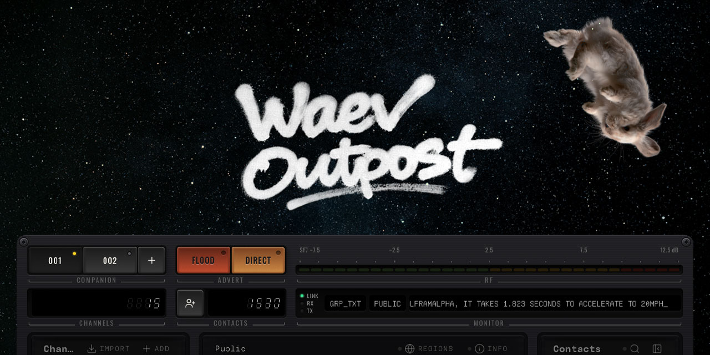
</p>

<h1 align="center">waev:outpost</h1>

<p align="center"><strong>A retro-futuristic operations console for <a href="https://meshcore.io/">MeshCore</a> LoRa mesh repeaters.</strong></p>

<p align="center">
  <a href="https://github.com/Treehouse-00/waev-outpost-plugin/releases"></a>
  <a href="https://github.com/Treehouse-00/pymc_console-dist/releases"></a>
  <a href="LICENSE"></a>
</p>

<p align="center">
  <a href="#quick-start">Quick start</a> ·
  <a href="#product-tour">Tour</a> ·
  <a href="#install">Install</a> ·
  <a href="#following-releases">Releases</a> ·
  <a href="#troubleshooting">Troubleshooting</a> ·
  <a href="#development">Development</a>
</p>

---

waev:outpost turns the live API and packet stream of an [openHop Repeater](https://github.com/openhop-dev/openhop_repeater) into one browser workspace: a map of the mesh, a packet lab, RF and noise-floor analytics, host telemetry, and a companion chat. It is a static web application that the repeater serves itself. Nothing else to run, nothing to patch.

waev:outpost was pyMC Console and then openHop Console. The repository, the `/opt/pymc_console` install directory and the `pymc-ui-*` archive names keep the old name, so existing installs and scripts keep working.

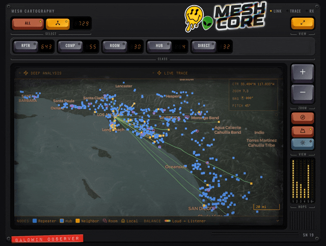

## Features at a glance

| | |
|---|---|
| **Retro-futuristic UI** | Keycaps, seven-segment readouts, LED meters and amber screen wells. Every page is an instrument, not a form. Dark and light, desktop and phone. |
| **Advanced mesh mapping** | 3D terrain, live traces, hop meters, and Viterbi path disambiguation that resolves colliding two-character prefixes to real nodes. |
| **Robust system stats** | Load, storage, heat and I/O on the front plate; CPU, memory, NVMe and sensor envelopes underneath, live. |
| **Local network I/O** | TX and RX rate scopes with peak hold, plus bytes and packets since boot. |
| **Noise-floor visualization and anomaly detection** | A density scatter of the floor across days, with tunable percentile thresholds that flag interference bursts. |
| **Robust packet filtering** | Type, route, status, signal, node class, free text and a time slider, all stacking. |
| **Mesh analytics with packet throughput** | Forwarded versus dropped by packet type over time, with duplicate rate, CRC failures and LBT wait. |
| **Public hash channel detection** | Hashed group channels recognised and named as they appear on air, decrypted where the key is known. |
| **Packet parsing with duplicate scanning** | A byte-level Wire Inspector that maps every field to its bytes, resolves the path on a map, and walks the copies of a flood. |
| **Companion chat** | Message the mesh straight from your repeater through a companion identity: channels and DMs, bot cards, reply, and an outbound queue meter. |

## Quick start

> [!TIP]
> **Three presses and you're in.** If your openHop Repeater has a **Plugins** page (repeaters from September 2026 do), open it, find **waev:outpost**, press **Install**, then **Enable**. That's it.

Open `http://<repeater-ip>:8000/plugins/waev.outpost/` and sign in with the same username and password you use for the repeater. Prefer waev:outpost at the repeater's front door, `http://<repeater-ip>:8000/`? Choose it as the repeater's web interface on the same Plugins page.

Installed this way, it looks after itself. When a new version is out, the version number at the top of the screen turns yellow. Tap it, press **Update**, and the repeater installs the new version and reloads the page for you.

No Plugins page on your repeater? This repository is the other way in: a small script that installs waev:outpost by hand. Read on under [Install](#install).

## Product tour

### The instrument

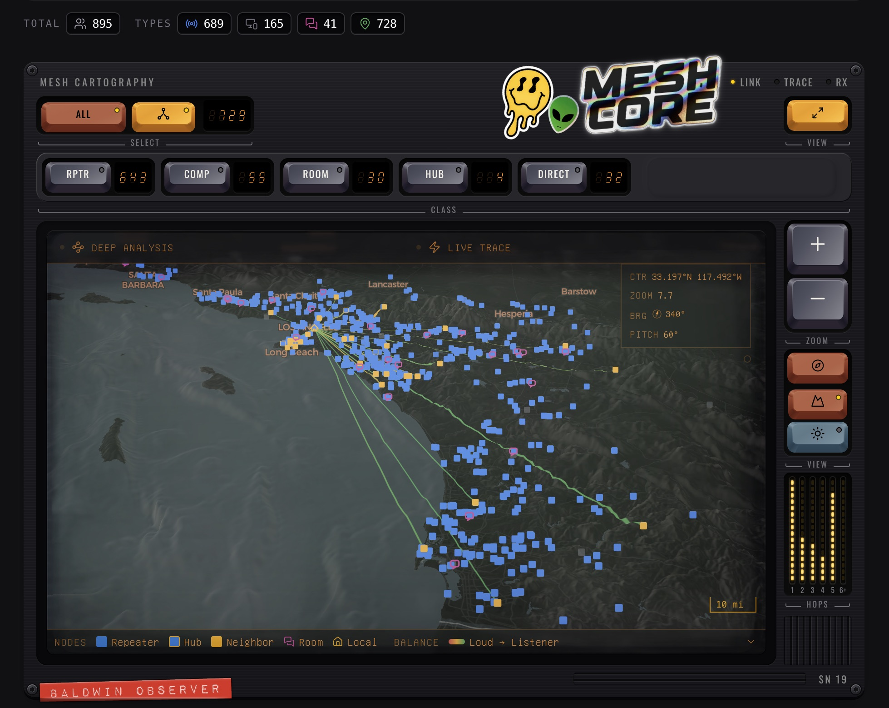

The console is built as hardware. Node classes are keycaps with their own counters. Zoom, view and basemap are keys on the right rail. Hop distribution is an LED column meter. The screen well carries the map with a CRT-style bezel, and the whole plate carries the identity of the node it is bolted to. The same parts kit, the TUI Kit, builds every other page, so once you have learned one panel you have learned them all.

### Mesh cartography

- MapLibre GL rendering with CARTO basemaps and 3D terrain from elevation tiles
- Repeaters, hubs, neighbours, rooms and your own node, filtered by class and link quality
- **Deep Analysis**: a Viterbi hidden Markov model picks the most probable path when a two-character prefix matches several nodes, weighing recency, co-occurrence, position, geography and measured edges
- **Live Trace**: packets animate along their resolved path as they arrive
- Ghost-node discovery for prefixes that never resolve, with RF-constrained location estimates
- Wardrive replay, GPS diagnostics, and a searchable contact inventory in the same workspace

### Packet lab

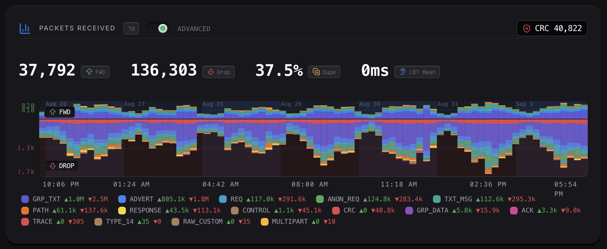

The throughput chart splits traffic into what the repeater forwarded and what it dropped, per packet type, across the selected window. The counters above it are the ones that matter for a repeater: forwarded, dropped, duplicate rate, CRC failures, and mean listen-before-talk wait.

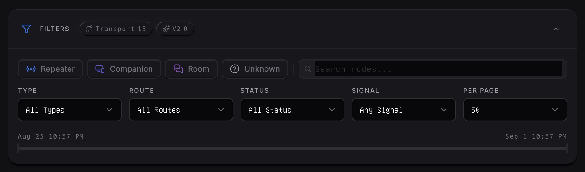

Filters stack. Pick a node class, a route type, a delivery status and a signal band, then narrow to a node by name and scrub the time slider. The same filter engine drives the Packets page and the Statistics analyzer, so a selection means the same thing everywhere.

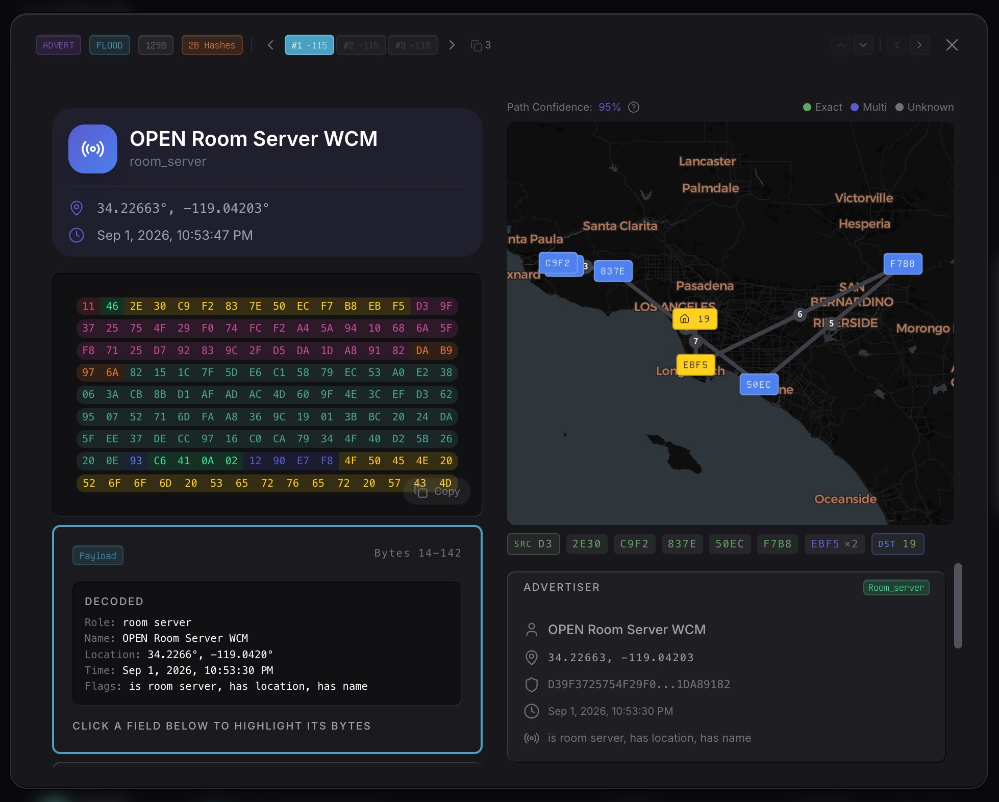

The **Wire Inspector** opens any packet down to its bytes. Header, hashes, path and payload are colour-mapped, and clicking a decoded field highlights the bytes that produced it. The path is resolved and drawn on a map with a confidence score per hop. When a flood arrives more than once, the copies are listed together so you can compare the routes they took.

### RF health

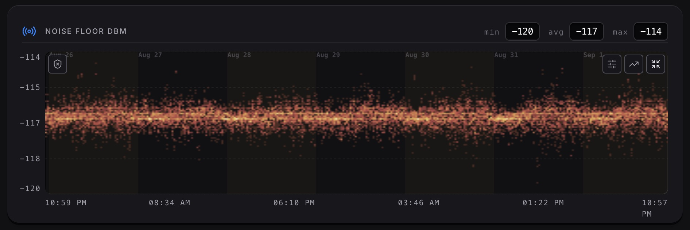

The noise floor is sampled continuously and drawn as a density scatter, so a week of readings shows its shape rather than a smeared average. Daily bands make diurnal patterns obvious.

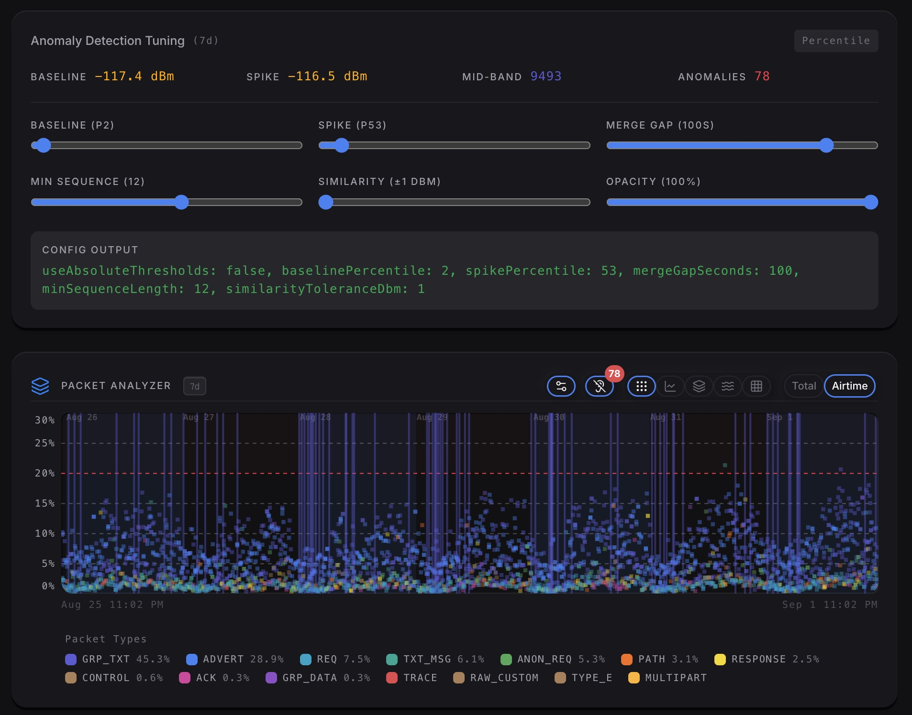

**Anomaly detection** watches the floor for sustained rises above a baseline. Baseline and spike percentiles, merge gap, minimum sequence length and similarity tolerance are sliders, and the resulting configuration is printed so it can be shared. Detected anomalies are counted and overlaid on the packet analyzer, which plots every packet by type across the window, as totals or as airtime.

### Channels

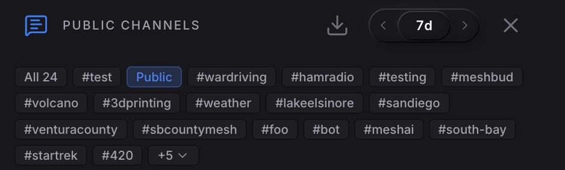

Group text on MeshCore travels under a channel hash. The console recognises the hashes that appear on air, names the ones it knows from its curated geographic and community channel list, and decrypts traffic for any channel whose key it holds. The dashboard shows chat activity per channel over the selected window.

### Companion chat

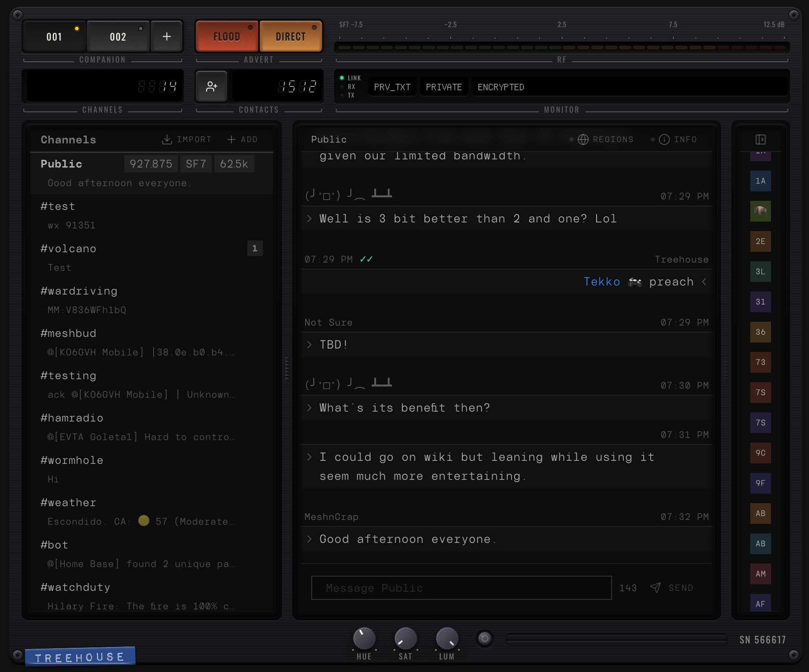

Create a companion identity on the repeater and the console becomes a messenger: no second radio, you talk to the mesh straight from your openHop node. Channels and direct messages sit in an amber LED screen with a contact roster, unread tallies, reply and delete on every message, and bot responses printed as instrument cards. The plate above it carries the companion selector, flood and zero-hop advert keys, the channel and contact counters, an outbound queue meter, and LINK, RX and TX lamps.

### Host telemetry

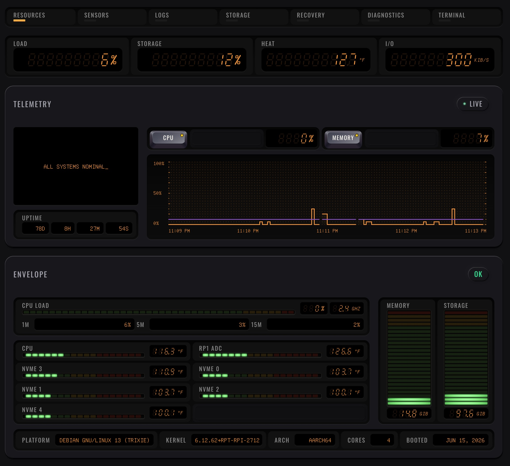

The System workspace reads the host the repeater runs on. Load, storage, heat and network I/O are seven-segment readouts. CPU and memory are a live scope. Temperature envelopes cover the SoC and every NVMe drive, and memory and storage are column meters. Sensors, logs, storage, recovery, diagnostics and a terminal are tabs in the same workspace.

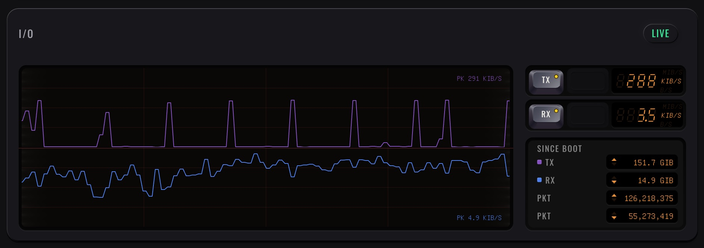

Local network I/O is a two-channel scope for the host's interface, with peak hold, current rates on the readouts, and bytes and packets since boot.

### Dashboard

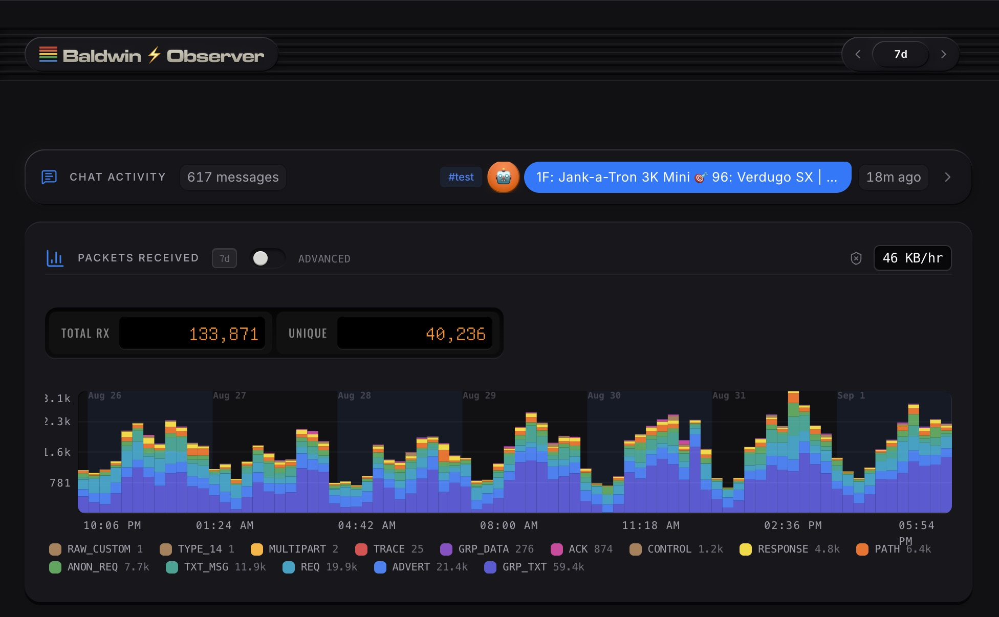

The home dashboard is the one-glance view: live traffic and recent packets, chat activity, mesh health, SpamGuard, and node context. On wide displays it becomes a pane-of-glass layout. Tap the version badge for the release notes.

---

## Install

### Two ways in

| Your repeater | How waev:outpost gets there | How it updates |
|---|---|---|
| Has a **Plugins** page | Install it from that page. [Step 2a](#2a-install-from-the-repeaters-plugins-page-recommended) | On its own. Press **Update** when the version number turns yellow. |
| Has no Plugins page | Run the `manage.sh` script from this repository. [Step 2b](#2b-install-by-hand) | `sudo bash manage.sh upgrade` |
| Runs in a **Proxmox LXC** | Create the container with the [openHop LXC installer](https://github.com/openhop-dev/openhop_repeater#proxmox-lxc-installation), then follow 2a or 2b. | As above |
| Runs in **Docker** | The `main` and `dev` images of `openhop/openhop-repeater` already include the matching waev:outpost. Nothing to install. | With the image |

### 1. Install openHop Repeater

waev:outpost requires a working Repeater backend. Follow the [openHop Repeater installation guide](https://github.com/openhop-dev/openhop_repeater), or use its installer:

```bash
git clone https://github.com/openhop-dev/openhop_repeater.git
cd openhop_repeater
sudo bash ./manage.sh install
```

Repeater owns the Python environment, radio and GPIO setup, `/etc/openhop_repeater/config.yaml`, authentication, and the `openhop-repeater` systemd service.

### 2a. Install from the repeater's Plugins page (recommended)

Your repeater can install waev:outpost for you, the same way a phone installs an app. Nothing to download, nothing to copy, and nothing written anywhere except the repeater's own plugin folder.

1. Open the repeater's web interface and go to **Configuration → Plugins**.
2. Find **waev:outpost** in the list of available plugins and press **Install**. The repeater fetches the package from [waev-outpost-plugin](https://github.com/Treehouse-00/waev-outpost-plugin), checks that it is genuine, and installs it.
3. Press **Enable**.
4. Open `http://<repeater-ip>:8000/plugins/waev.outpost/` and sign in. If you'd like waev:outpost to be what you see at `http://<repeater-ip>:8000/`, choose it as the repeater's web interface on the same page.

#### Keeping it up to date

You don't have to do anything. waev:outpost quietly asks the repeater every so often whether a newer version is available. When one is:

1. The version number at the top of the screen turns **yellow**.
2. Tap it to open **What's new**, and press **Update**.
3. The repeater installs the new version while you watch, then reloads the page.

There's a **Check** button on the same screen if you'd rather ask right away, and the repeater's own Plugins page offers the same update.

> [!NOTE]
> A brand-new release takes a little while to reach your repeater's plugin list. If you've just seen an announcement and nothing appears yet, check back later.

<details>
<summary><strong>From a script instead</strong></summary>

The same steps are available from the API with a repeater token:

```bash
curl -X POST http://<repeater-ip>:8000/api/plugins/catalogue_install \
  -H "Authorization: Bearer <token>" -H "Content-Type: application/json" \
  -d '{"id": "waev.outpost"}'
curl -X POST http://<repeater-ip>:8000/api/plugins/enable \
  -H "Authorization: Bearer <token>" -H "Content-Type: application/json" \
  -d '{"id": "waev.outpost"}'
```

`POST /api/plugins/update` with the same body installs an update.

</details>

### 2b. Install by hand

For a repeater without a Plugins page, or if you'd rather keep the files yourself under `/opt/pymc_console`. On the repeater itself:

```bash
cd ~
git clone --depth 1 --single-branch --branch main --no-tags \
  https://github.com/Treehouse-00/pymc_console-dist.git pymc_console
cd pymc_console
sudo bash manage.sh install
```

<details>
<summary><strong>Why a shallow clone?</strong></summary>

It saves space on small hosts. Each release replaces the public branch with one snapshot, so prior releases and their history are not reachable from this repository. The checkout holds the installer and the documentation; the built files come from the current GitHub release. An older full clone keeps objects it already downloaded, so re-clone once to reclaim that space.

</details>

The script:

1. Verifies that openHop Repeater is installed.
2. Downloads the latest `pymc-ui-latest.tar.gz` release.
3. Extracts the static app to `/opt/pymc_console/web/html/`.
4. On a fresh install, sets `web.web_path` in `/etc/openhop_repeater/config.yaml` when `yq` is available.
5. Leaves Repeater, Core, radio configuration, and service lifecycle untouched.

Open `http://<repeater-ip>:8000/` and sign in with the credentials configured for Repeater.

> [!IMPORTANT]
> Port 8000 is meant for a trusted LAN or VPN. Do not expose the repeater's API and waev:outpost directly to the public internet.

Prefer to place the files yourself? [INSTALL.md](INSTALL.md) walks through it.

### Upgrade

Installed from the Plugins page? There is nothing to run. Press **Update** in What's new when the version number turns yellow, or use the repeater's Plugins page. Installed by hand? Run the script again:

```bash
cd ~/pymc_console
sudo bash manage.sh upgrade
```

The script first brings its own checkout up to date, then replaces the dashboard files with the latest release. Your existing `web.web_path` is kept. The repeater itself is upgraded separately, with its own `manage.sh`.

### Uninstall

```bash
cd ~/pymc_console
sudo bash manage.sh uninstall
```

This removes `/opt/pymc_console` and, after confirmation, the waev:outpost checkout, and clears `web.web_path` in the Repeater's config if it still points at the dashboard, so the Repeater falls back to its own UI. A `web_path` you set by hand to something else is left alone. It does not uninstall openHop Repeater or modify its radio setup.

### Automation

Use `--yes`/`-y` or `ASSUME_YES=1` to auto-confirm prompts:

```bash
sudo bash manage.sh --yes install
ASSUME_YES=1 sudo -E bash manage.sh upgrade
```

Set `NO_COLOR=1` for plain output. Run `sudo bash manage.sh --help` for the complete command summary.

### Following releases

Release notes live in [CHANGELOG.md](CHANGELOG.md) and on the latest [GitHub release](https://github.com/Treehouse-00/pymc_console-dist/releases), and inside the console: tap the version number for **What's new**.

Every release is published in two places at once:

| | |
|---|---|
| [**waev-outpost-plugin**](https://github.com/Treehouse-00/waev-outpost-plugin) | The plugin package. This is what a repeater's Plugins page installs. |
| [**pymc_console-dist**](https://github.com/Treehouse-00/pymc_console-dist) | This repository: the script and the files for a hand install. |

For bots and automation:

- **Atom feed** (RSS bots, Discord/Slack feed integrations):
  `https://github.com/Treehouse-00/pymc_console-dist/releases.atom`
- **Latest release JSON** (scripts and webhooks — no auth required; `tag_name`, `body`, assets):
  `https://api.github.com/repos/Treehouse-00/pymc_console-dist/releases/latest`
- **Raw changelog** (full history as markdown):
  `https://raw.githubusercontent.com/Treehouse-00/pymc_console-dist/main/CHANGELOG.md`

---

## Management boundaries

`manage.sh` is intentionally dashboard-only:

| Command | waev:outpost action | Repeater impact |
|---|---|---|
| `install` | Installs the latest dashboard into `/opt/pymc_console/web/html/` | Sets `web.web_path` on first install when possible |
| `upgrade` | Self-updates the checkout and replaces dashboard assets | Preserves Repeater configuration and service state |
| `uninstall` | Removes waev:outpost assets and its checkout after confirmation; clears `web.web_path` if it still points at the dashboard | Does not uninstall Repeater |

Use Repeater's installer or standard service tools for backend lifecycle:

```bash
sudo systemctl status openhop-repeater
sudo systemctl restart openhop-repeater
sudo journalctl -u openhop-repeater -f
```

---

## Repeater compatibility

waev:outpost is built against the openHop Repeater `dev` branch and checked against it before each release; this release was checked against `dev` as of 2 September 2026 and against a 1.1.2 development build in daily use. Everything the console shows comes from the Repeater's own HTTP API and its two WebSocket streams, `/ws/packets` for the live mesh and `/ws/companion_frame` for the companion page; the console applies no patches to the Repeater and needs nothing installed beside it.

Where the Repeater renamed something, the console reads both the old and the new name and writes whichever the Repeater it is talking to understands, so an older Repeater keeps working:

- Modem transports: `pymc_tcp` and `pymc_usb` became `modem_tcp` and `modem_usb` in August 2026.
- The modem sensor: `pymc_modem` became `openhop_modem`.
- ACL roles: the Repeater now reports `admin`, `read_write`, `read_only` and `guest` with MeshCore's numbering; older ones report only `admin` and `guest`.
- The stats WebSocket now carries the sidebar vitals (uptime, mode, utilisation, noise floor, advert tier) in every beat and the 24-hour packet aggregate one beat in six; the console reads either cadence.
- Noise-floor history is paged: a Repeater from September 2026 answers with up to 300 samples an hour of the window where older ones answered with the newest 1,000 samples, so the console now asks for a bounded page on every Repeater.
- Config exports and the stats view redact the modem's TCP token to `*** REDACTED ***`; posting that value back leaves the stored token in place, so a re-imported export or a saved radio form never clears it.
- A multi-radio Repeater lists its radios and names a default; the Configuration page's Radio module and the Radio Hardware page pick which one to edit and write to that radio's entry. Packets from such a Repeater carry `rx_radio_id` and `tx_radio_id`, which are typed but not yet shown on a packet row.

Two optional back ends are used when present and done without otherwise. The analytics API (`/api/analytics/*`) is not part of the upstream Repeater; without it the console computes topology, disambiguation and sparklines itself. The companion REST API (`/api/v1/companions`) comes from our fork of the Repeater; without it the companion page works over the frame stream alone.

Features that need a Repeater from mid-2026 or newer hide themselves on an older one rather than failing: the direct advert key beside Send Advert and the direct advert interval fields, the discovered regions list and a node's region scopes with its "ask now" key, the MQTT page's neighbours-table schedule and Publish now key, the CAD page's Manual Check, the Neighbour Links page under Statistics, and the multi-radio selector. The Logs page listens to the Repeater's log stream and falls back to polling when the stream is refused.

Repeater features the console knows about but does not draw yet, kept in its API layer with a note of where each belongs: noise-floor and route statistics, the count of adverts by node class, the Docker-safety flag on serial ports, a BME280 sensor card, server-side session verification, the radio a packet arrived on, and the server-sent-event streams for GPS and neighbour discovery where the console still polls.

---

## Troubleshooting

### waev:outpost does not load, or the Repeater's own UI appears

```bash
sudo systemctl status openhop-repeater
curl -s http://localhost:8000/api/stats | head -c 200
sudo journalctl -u openhop-repeater -n 100
```

Confirm that `/etc/openhop_repeater/config.yaml` contains:

```yaml
web:
  web_path: /opt/pymc_console/web/html
```

If `yq` was unavailable during install, the installer prints the exact command needed to set this value. Set it by hand, then restart the service:

```bash
sudo yq -i '.web.web_path = "/opt/pymc_console/web/html"' /etc/openhop_repeater/config.yaml
sudo systemctl restart openhop-repeater
```

### `manage.sh install` says Repeater is not installed

The installer looks for `/opt/openhop_repeater` (and the older `/opt/pymc_repeater`). Install Repeater first with its own `manage.sh`, then rerun the waev:outpost installer. A Docker image of Repeater already contains waev:outpost; do not install it inside the container.

### Login fails or the UI and API disagree

Update Repeater and waev:outpost independently, then hard-refresh the browser:

```bash
cd ~/openhop_repeater && sudo bash ./manage.sh upgrade
cd ~/pymc_console && sudo bash manage.sh upgrade
```

Use `Cmd+Shift+R` on macOS or `Ctrl+Shift+R` on Linux/Windows to bypass a stale cached `index.html`. The version badge in the sidebar shows the build you are running.

### waev:outpost loads but no packets appear

- Allow a fresh Repeater 30–60 seconds to initialize.
- Confirm radio frequency, GPIO, and SPI/USB transport in Repeater configuration.
- Check the live service log with `journalctl`.
- The connection dot in the sidebar reports the packet WebSocket. If it degrades, the console falls back to polling; if it stays offline, check that nothing between the browser and port 8000 strips WebSocket upgrades.

### Channels show hashes instead of names

A channel is named when its hash matches the curated list or a channel you have joined. Under Messages → Manage, join a hashtag channel by name, or a private channel by pasting its key, and traffic already in the local cache is decrypted for it.

### The companion page says another client is connected

A companion's Frame link serves one client at a time. Close the other session, or take the link from this one with the TAKE key in the STATUS pocket; the other client is told it was displaced. The Companion API mode keeps chat available without the Frame link at all, at the cost of the trusted radio controls.

### Data looks stale, or the repeater's database has grown large

The console caches packets in browser storage so history survives reloads; a hard refresh rebuilds that cache from the repeater. The repeater's own database is managed under System → Storage, where tables can be purged and the file vacuumed.

---

## How it works

```
Browser
  └─ waev:outpost (React + TypeScript + Vite)
       ├─ REST API: configuration, history, analytics, system state
       ├─ WebSocket: live radio and packet events
       ├─ Browser storage: localStorage packet cache, IndexedDB companion messages
       └─ Web workers: bucketing, decoding, and topology analysis
                    │
                    ▼
       openHop Repeater (Python service, port 8000)
       ├─ authentication and API
       ├─ packet forwarding and persistence
       ├─ radio and GPIO control
       └─ openHop Core / MeshCore protocol implementation
```

waev:outpost is deployed as static assets under `/opt/pymc_console/web/html/`. Repeater serves the SPA and the same-origin API, which avoids a second production service or cross-origin configuration. The console applies no patches to Repeater and writes one setting in its config, `web.web_path`.

### Analysis pipeline

MeshCore paths carry two-character node prefixes, so several nodes may match a hop. waev:outpost uses a Viterbi hidden Markov model to select the most probable path from known candidates plus an unknown-node state. Scoring combines observation recency, prefix co-occurrence, path position, geographic plausibility, and measured edge evidence. The resulting topology powers path confidence, ghost-node discovery, link analysis, and TX-delay recommendations.

The frontend also contains a TypeScript MeshCore protocol implementation for binary frame parsing, packet-type decoding, channel-key derivation, and group-text decryption. Heavy work runs in web workers so the instruments stay responsive on a phone.

---

## Development

The source repository uses React 18, TypeScript, Vite 6, Zustand, MapLibre GL, µPlot, and xterm.js.

Installing source dependencies requires access to the Motion+ registry. CI injects the repository's `MOTION_TOKEN` into the `__MOTION_TOKEN__` placeholders in `package.json` and `package-lock.json`. For a fresh local install, do the same with the same organization credential: run `MOTION_TOKEN=<token> ./scripts/inject-motion-token.sh` from the repository root before `npm install`, then `./scripts/inject-motion-token.sh restore` to put the placeholders back.

```bash
git clone https://github.com/Treehouse-00/pymc_console.git
cd pymc_console/frontend
cp .env.example .env.local
# Set VITE_API_URL in .env.local to a running Repeater, then:
npm install
npm run dev
```

Useful checks:

```bash
npm run typecheck
npm run test
npm run lint
npm run build
```

Production builds are written to `frontend/out/`; `npm run build:static` also copies the packaged output to `frontend/dist/`.

### openHop plugin wheel

The console also ships as a UI-only openHop plugin. Once the wheel is installed and enabled, the repeater can select the plugin's `ui/` directory as its primary frontend (its `web.web_path`), so waev:outpost answers at the root URL exactly where the built-in dashboard or a standalone install would; `/plugins/waev.outpost/` remains as an optional direct route to the same build. Switching between the built-in dashboard, a standalone install and the plugin keeps the root URL. From `frontend/`:

```bash
npm run build:plugin
```

That builds the SPA a second time with the absolute `/plugins/waev.outpost/` base into `frontend/out-plugin/` (the root install keeps `/`; a relative base would break nested deep links), stages `plugin-stage/` (`openhop-plugin.json` stamped with the package version, plus `ui/`), and packs a PEP 427 wheel under `plugin-dist/`:

```text
plugin-dist/waev_outpost_plugin-<version>-py3-none-any.whl
```

Install the wheel from the repeater's **System → Plugins** page (or `POST /api/plugins/install`), enable it, then either select it as the repeater's frontend and open `/`, or open `/plugins/waev.outpost/` directly. Every release publishes the wheel as the single `.whl` asset of the [waev-outpost-plugin](https://github.com/Treehouse-00/waev-outpost-plugin) release. Published plugin releases are retained because approved catalogue entries and rollbacks use exact versioned release URLs. After publication, the Console catalogue workflow downloads and verifies those release bytes, calculates their SHA-256, and opens a ready PR for `waev.outpost` through the catalogue publisher GitHub App. Catalogue-owned certification policy and required checks control automatic merging; retries preserve any existing human-selected draft state. See [release setup](RELEASE.md) for the required repository secrets. Re-pack only (after a prior stage) with `npm run pack:plugin`.

---

## License

MIT. See [LICENSE](LICENSE).

## Credits

- [RightUp](https://github.com/rightup) — creator of the original pyMC Repeater/Core projects and a maintainer of the MeshCore Python ecosystem
- [openHop Repeater](https://github.com/openhop-dev/openhop_repeater) — Repeater daemon and the backend waev:outpost plugs into
- [openHop Core](https://github.com/openhop-dev/openhop_core) — MeshCore protocol library
- [MeshCore](https://meshcore.io/) — MeshCore project and community
- [d40cht/meshcore-connectivity-analysis](https://github.com/d40cht/meshcore-connectivity-analysis) — Viterbi HMM approach for path disambiguation
- [meshcore-bot](https://github.com/agessaman/meshcore-bot) — recency scoring and dual-hop anchor disambiguation

---

<p align="center"><sub>waev:outpost is built as hardware: every page is an instrument, not a form. Bolt it to your repeater and watch the mesh breathe.</sub></p>
