<p align="center">
  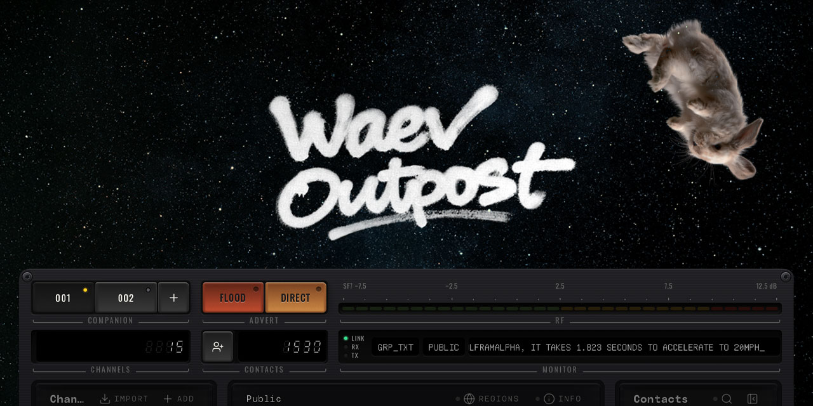
</p>

<h1 align="center">waev:outpost</h1>

<p align="center"><strong>A retro-futuristic operations console for <a href="https://meshcore.io/">MeshCore</a> LoRa mesh repeaters.</strong></p>

<p align="center">
  <a href="https://github.com/Treehouse-00/waev-outpost-plugin/releases"></a>
  <a href="#migrate-from-the-standalone-install"></a>
  <a href="LICENSE"></a>
</p>

<p align="center">
  <a href="#quick-start">Quick start</a> ·
  <a href="#product-tour">Tour</a> ·
  <a href="#install">Install</a> ·
  <a href="#following-releases">Releases</a> ·
  <a href="#troubleshooting">Troubleshooting</a> ·
  <a href="#development">Development</a>
</p>

---

waev:outpost turns the live API and packet stream of an [openHop Repeater](https://github.com/openhop-dev/openhop_repeater) into one browser workspace: a map of the mesh, a packet lab, RF and noise-floor analytics, host telemetry, and a companion chat. It is a static web application that the repeater serves itself. Nothing else to run, nothing to patch.

waev:outpost was pyMC Console and then openHop Console. New versions are delivered through the **waev:outpost Repeater plugin**. **v0.9.394 is the final legacy standalone release** from `pymc_console-dist`; existing files under `/opt/pymc_console` can stay in place while you [move to the plugin](#migrate-from-the-standalone-install).

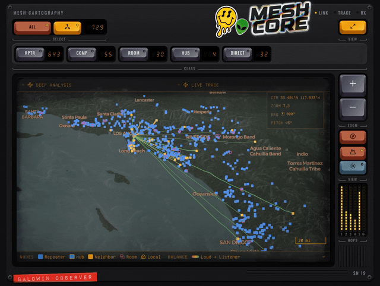

## Features at a glance

| | |
|---|---|
| **Retro-futuristic UI** | Keycaps, seven-segment readouts, LED meters and amber screen wells. Every page is an instrument, not a form. Dark and light, desktop and phone. |
| **Advanced mesh mapping** | 3D terrain, live traces, hop meters, and Viterbi path disambiguation that resolves colliding two-character prefixes to real nodes. |
| **Robust system stats** | Load, storage, heat and I/O on the front plate; CPU, memory, NVMe and sensor envelopes underneath, live. |
| **Local network I/O** | TX and RX rate scopes with peak hold, plus bytes and packets since boot. |
| **Noise-floor visualization and anomaly detection** | A density scatter of the floor across days, with tunable percentile thresholds that flag interference bursts. |
| **Robust packet filtering** | Type, route, status, signal, node class, free text and a time slider, all stacking. |
| **Mesh analytics with packet throughput** | Forwarded versus dropped by packet type over time, with duplicate rate, CRC failures and LBT wait. |
| **Public hash channel detection** | Hashed group channels recognised and named as they appear on air, decrypted where the key is known. |
| **Packet parsing with duplicate scanning** | A byte-level Wire Inspector that maps every field to its bytes, resolves the path on a map, and walks the copies of a flood. |
| **Companion chat** | Message the mesh straight from your repeater through a companion identity: channels and DMs, bot cards, reply, and an outbound queue meter. |

## Quick start

1. In the **built-in Repeater interface**, open **System → Plugins → Catalogue**.
2. Find **waev:outpost** and press **Install**. Catalogue installation enables it automatically. If the Installed tab shows it as disabled, press **Enable**.
3. Use **Open UI**, or open `http://<repeater-ip>:8000/plugins/waev.outpost/`, and sign in with your existing Repeater credentials.

To serve waev:outpost at `http://<repeater-ip>:8000/`, return to the built-in interface and open **System → Configuration → Access → Web Options → Web Frontend**. Select **waev:outpost**; the built-in interface applies the choice immediately. The direct plugin address remains available.

For updates, use **System → Plugins → Catalogue → Refresh**, then **Update** when offered. In waev:outpost, the version badge also offers **What's new → Update** when the repeater reports an available plugin update. Updates need your confirmation and become available after catalogue approval.

Already using the standalone console? Start with [Migrate from the standalone install](#migrate-from-the-standalone-install). If your repeater has no Plugins page, [upgrade Repeater first](INSTALL.md#prerequisite).

## Product tour

### The instrument

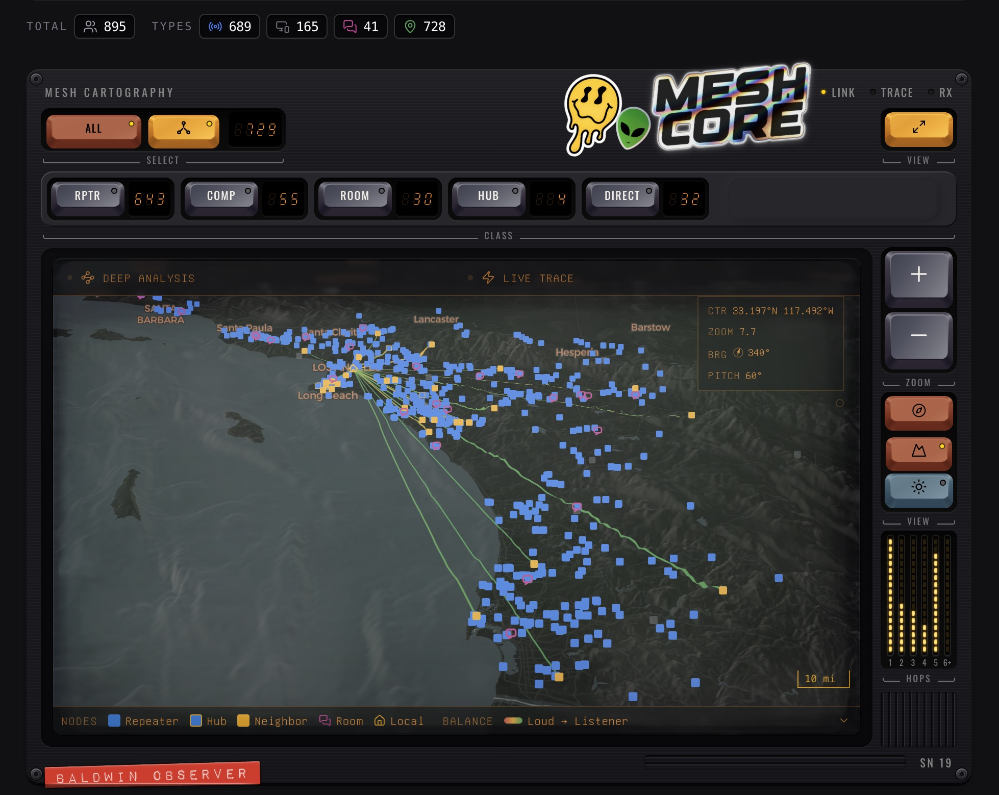

The console is built as hardware. Node classes are keycaps with their own counters. Zoom, view and basemap are keys on the right rail. Hop distribution is an LED column meter. The screen well carries the map with a CRT-style bezel, and the whole plate carries the identity of the node it is bolted to. The same parts kit, the TUI Kit, builds every other page, so once you have learned one panel you have learned them all.

### Mesh cartography

- MapLibre GL rendering with CARTO basemaps and 3D terrain from elevation tiles
- Repeaters, hubs, neighbours, rooms and your own node, filtered by class and link quality
- **Deep Analysis**: a Viterbi hidden Markov model picks the most probable path when a two-character prefix matches several nodes, weighing recency, co-occurrence, position, geography and measured edges
- **Live Trace**: packets animate along their resolved path as they arrive
- Ghost-node discovery for prefixes that never resolve, with RF-constrained location estimates
- Wardrive replay, GPS diagnostics, and a searchable contact inventory in the same workspace

### Packet lab

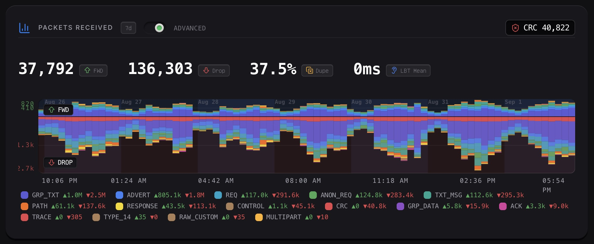

The throughput chart splits traffic into what the repeater forwarded and what it dropped, per packet type, across the selected window. The counters above it are the ones that matter for a repeater: forwarded, dropped, duplicate rate, CRC failures, and mean listen-before-talk wait.

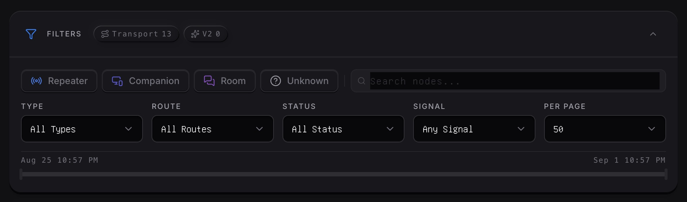

Filters stack. Pick a node class, a route type, a delivery status and a signal band, then narrow to a node by name and scrub the time slider. The same filter engine drives the Packets page and the Statistics analyzer, so a selection means the same thing everywhere.

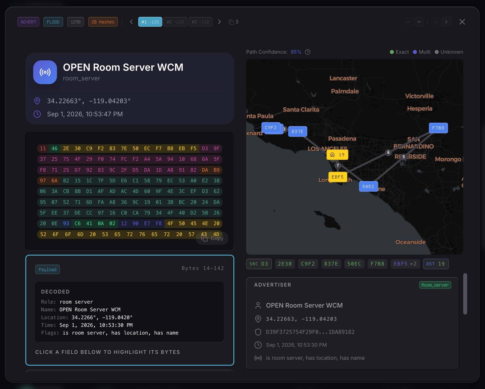

The **Wire Inspector** opens any packet down to its bytes. Header, hashes, path and payload are colour-mapped, and clicking a decoded field highlights the bytes that produced it. The path is resolved and drawn on a map with a confidence score per hop. When a flood arrives more than once, the copies are listed together so you can compare the routes they took.

### RF health

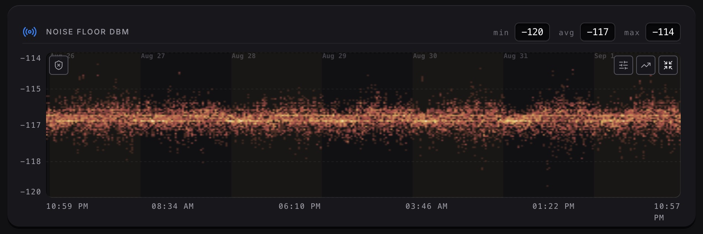

The noise floor is sampled continuously and drawn as a density scatter, so a week of readings shows its shape rather than a smeared average. Daily bands make diurnal patterns obvious.

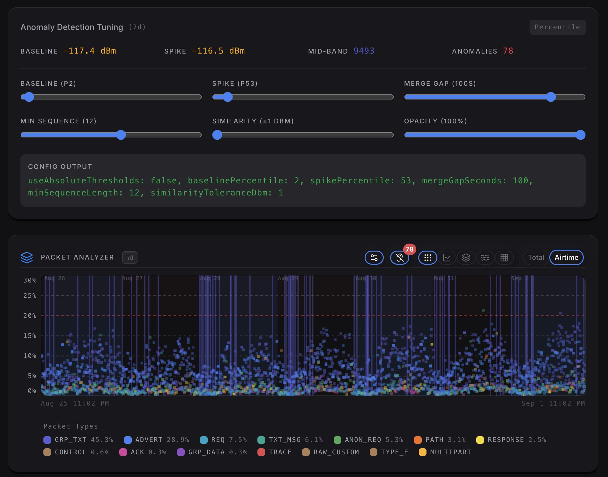

**Anomaly detection** watches the floor for sustained rises above a baseline. Baseline and spike percentiles, merge gap, minimum sequence length and similarity tolerance are sliders, and the resulting configuration is printed so it can be shared. Detected anomalies are counted and overlaid on the packet analyzer, which plots every packet by type across the window, as totals or as airtime.

### Channels

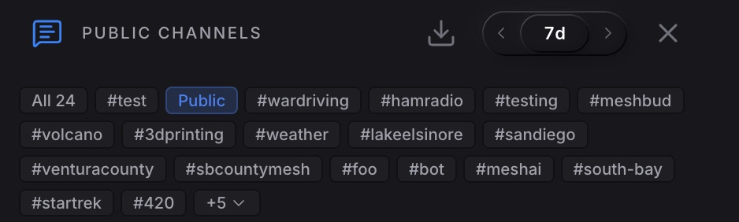

Group text on MeshCore travels under a channel hash. The console recognises the hashes that appear on air, names the ones it knows from its curated geographic and community channel list, and decrypts traffic for any channel whose key it holds. The dashboard shows chat activity per channel over the selected window.

### Companion chat

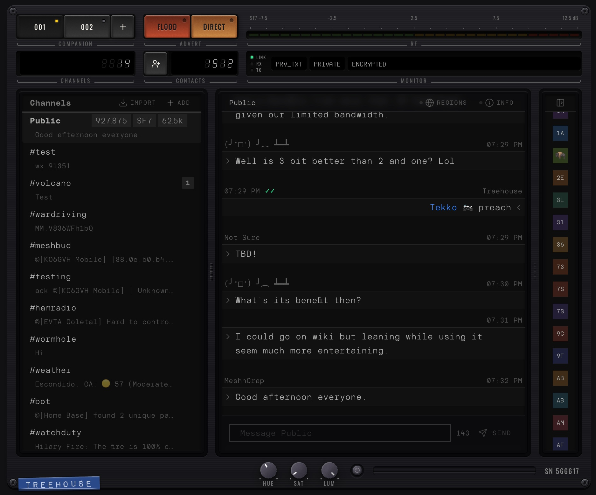

Create a companion identity on the repeater and the console becomes a messenger: no second radio, you talk to the mesh straight from your openHop node. Channels and direct messages sit in an amber LED screen with a contact roster, unread tallies, reply and delete on every message, and bot responses printed as instrument cards. The plate above it carries the companion selector, flood and zero-hop advert keys, the channel and contact counters, an outbound queue meter, and LINK, RX and TX lamps.

### Host telemetry

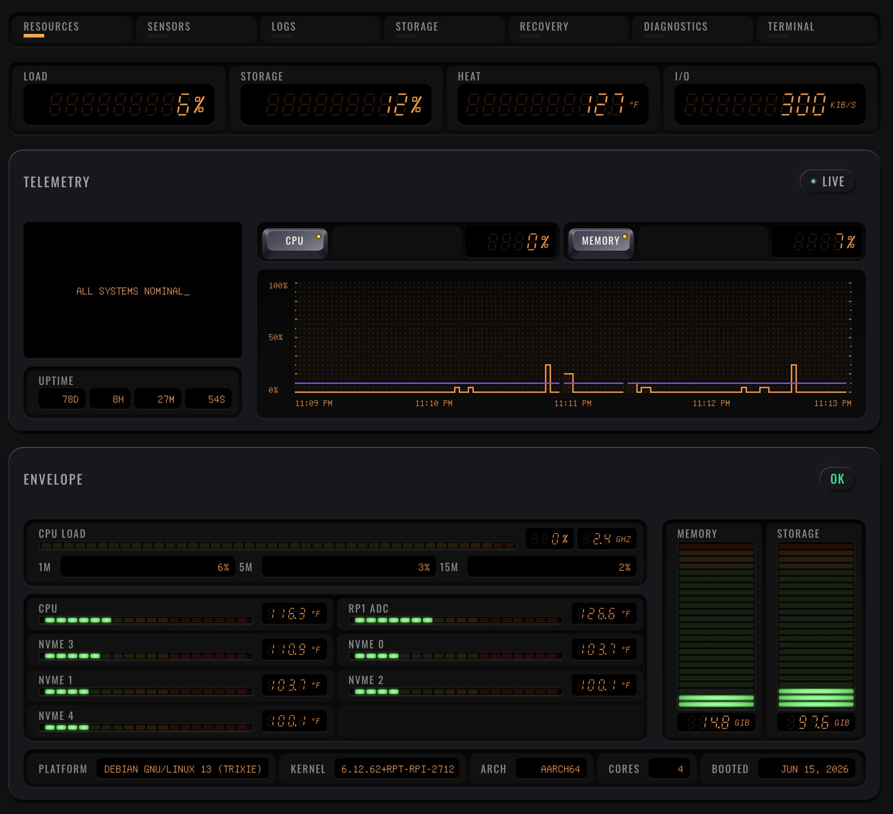

The System workspace reads the host the repeater runs on. Load, storage, heat and network I/O are seven-segment readouts. CPU and memory are a live scope. Temperature envelopes cover the SoC and every NVMe drive, and memory and storage are column meters. Sensors, logs, storage, recovery, diagnostics and a terminal are tabs in the same workspace.

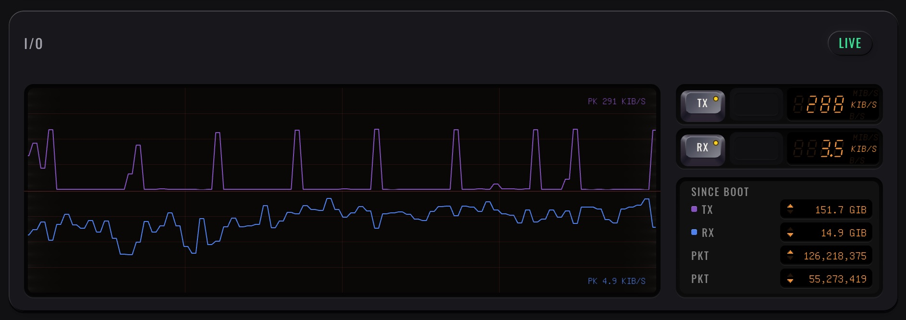

Local network I/O is a two-channel scope for the host's interface, with peak hold, current rates on the readouts, and bytes and packets since boot.

### Dashboard

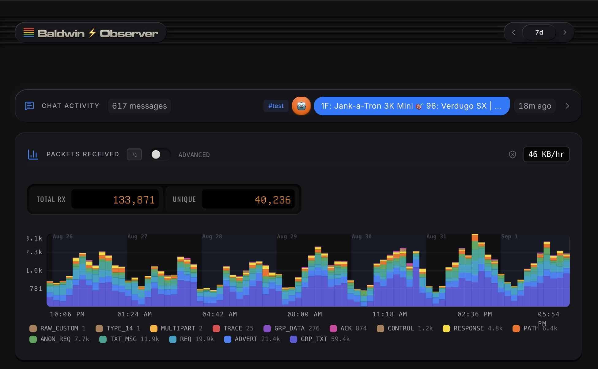

The home dashboard is the one-glance view: live traffic and recent packets, chat activity, mesh health, SpamGuard, and node context. On wide displays it becomes a pane-of-glass layout. Tap the version badge for the release notes.

---

## Install

waev:outpost is an application UI plugin managed by openHop Repeater. The plugin is the channel for new releases; the standalone distribution stops at **v0.9.394**.

<a id="two-ways-in"></a>

| Starting point | Next step |
|---|---|
| Built-in Repeater interface with **Plugins** | [Install from the catalogue](#2a-install-from-the-repeaters-plugins-page-recommended). |
| Existing waev:outpost standalone install | [Switch to the built-in interface and migrate](#migrate-from-the-standalone-install). |
| Repeater without a Plugins page, or with an unavailable plugin manager | [Update Repeater and its plugin manager](INSTALL.md#prerequisite). |
| Repeater in Docker or Proxmox LXC | Use the same plugin workflow once the Repeater plugin manager is available. Follow [Repeater's installation guide](https://github.com/openhop-dev/openhop_repeater) for the host or container setup. |

### 1. Install openHop Repeater

waev:outpost requires a working [openHop Repeater](https://github.com/openhop-dev/openhop_repeater) with application UI plugin support. Use Repeater's installation or upgrade instructions for your platform. Existing native installations may need to run its updated `manage.sh upgrade` once as an administrator to refresh the privileged upgrade helper; see the [plugin prerequisites](INSTALL.md#prerequisite).

Repeater owns the radio configuration, identities, credentials, storage and service. Installing this UI plugin does not reset them. Use your existing repeater address; the examples here assume its default port, 8000.

### 2a. Install from the repeater's Plugins page (recommended)

1. In the **built-in Repeater interface**, open **System → Plugins → Catalogue**.
2. Find **waev:outpost** and press **Install**. The repeater downloads the approved wheel and checks its checksum, plugin ID and version against the catalogue.
3. On the **Installed** tab, confirm **UI READY**. Catalogue installs are enabled automatically; if it is disabled, press **Enable**.
4. Use **Open UI** or visit `http://<repeater-ip>:8000/plugins/waev.outpost/`. Sign in with your existing Repeater credentials.
5. To make it the default at `/`, return to the built-in interface and open **System → Configuration → Access → Web Options → Web Frontend**. Select **waev:outpost**, the plugin entry. This applies immediately and the page refreshes into the chosen interface.

If an older standalone copy is also installed, choose the plugin entry, not **openHop Console** pointing at `/opt/pymc_console/web/html`.

#### Keeping it up to date

In the built-in interface, use **System → Plugins → Catalogue → Refresh**, then **Update** for waev:outpost when offered. From waev:outpost, tap the version badge to open **What's new**, use **Check**, and press **Update** when the repeater reports an available plugin update.

Updates are approved by you, not installed automatically. The plugin uses the same Repeater configuration and credentials after an update. A new GitHub release appears in the catalogue only after its metadata has been approved; **Refresh** cannot install a version that is not approved yet.

<a id="2b-install-by-hand"></a>

### 2b. Install a plugin wheel

Use this when you need to install a release directly or cannot reach the catalogue:

1. Download the single `.whl` asset from a [waev-outpost-plugin release](https://github.com/Treehouse-00/waev-outpost-plugin/releases).
2. In the built-in interface, open **System → Plugins → Install wheel**, choose the file, and press **Install**.
3. Press **Enable** if the plugin is disabled, then open its UI and optionally select it under **Web Options → Web Frontend** as above.

A fresh local-wheel installation has no catalogue repository metadata, so **Update** may be unavailable. Update it by uploading a newer wheel with **Install wheel** again. To adopt catalogue-managed updates, reinstall the approved catalogue version using the [authenticated API](INSTALL.md#automation); check the approved version first because it may be older than a manually uploaded release.

### Migrate from the standalone install

The `pymc_console-dist` distribution and its `manage.sh upgrade` path end at **v0.9.394**. New waev:outpost versions are published as the `waev.outpost` plugin.

1. Keep `/opt/pymc_console/web/html` and your existing Repeater configuration in place. No uninstall, credential reset or radio reconfiguration is needed.
2. In your current waev:outpost, open **Configuration → Web Frontend** and select **Default Frontend**, the built-in Repeater interface. In v0.9.394 this applies immediately and reloads. In newer waev versions, press **Set as default interface**, then **Open default interface in a new tab**. Open your repeater's home address `/` if you are still viewing the direct plugin URL.
3. In the built-in interface, follow **System → Plugins → Catalogue → waev:outpost → Install**. Confirm **UI READY** and open `/plugins/waev.outpost/` to check the installed version and your repeater connection.
4. Make the plugin the default through **System → Configuration → Access → Web Options → Web Frontend**. Choose the **waev:outpost plugin** entry.

Repeater still serves the same API with the same configuration, radio identities and login credentials. Keep the same host, port and protocol to retain access to that browser origin's saved preferences. Your old standalone files can remain as a fallback.

To switch back, choose **Default Frontend** again. To temporarily use the old standalone copy, choose **openHop Console** in the built-in interface while `/opt/pymc_console/web/html` still exists; waev labels that choice **waev:outpost · standalone install**. Your old copy keeps its installed version; the standalone channel ends at v0.9.394. See [the complete migration and recovery guide](INSTALL.md#migrate-from-the-standalone-install) if the current UI cannot be opened.

### Upgrade

For a catalogue installation, use [Keeping it up to date](#keeping-it-up-to-date). For a local-wheel installation, use [Install a plugin wheel](#2b-install-a-plugin-wheel). Existing standalone users must [migrate to the plugin](#migrate-from-the-standalone-install) for new versions; rerunning the old `manage.sh upgrade` does not migrate the installation.

Repeater itself is updated separately through its supported installer or container upgrade process.

### Uninstall

First choose **Default Frontend** and open the repeater's home address to confirm that the built-in interface works. Then use **System → Plugins → Installed → Uninstall** for waev:outpost. Leave **Also delete persistent data directory** unchecked if you want to keep plugin data for a later reinstall.

Removing a UI plugin does not uninstall Repeater. The old `/opt/pymc_console` folder is separate, and deleting it is not part of migration. See [legacy recovery and cleanup](INSTALL.md#legacy-standalone-reference) before removing any old files.

### Automation

The [installation guide](INSTALL.md#automation) documents authenticated catalogue installation, wheel upload, updates and default-interface selection. These operations use Repeater's existing API credentials.

### Following releases

Release notes live in [CHANGELOG.md](CHANGELOG.md), on [waev-outpost-plugin releases](https://github.com/Treehouse-00/waev-outpost-plugin/releases), and in the console's **What's new** dialog.

The [plugin repository](https://github.com/Treehouse-00/waev-outpost-plugin) carries all new versions. The [final standalone v0.9.394 release](https://github.com/Treehouse-00/pymc_console-dist/releases/tag/v0.9.394) is a legacy fallback, not an update channel. Published plugin versions remain available at their versioned release URLs.

For bots and automation:

- **Atom feed** (RSS readers and feed integrations):
  `https://github.com/Treehouse-00/waev-outpost-plugin/releases.atom`
- **Latest published release JSON** (`tag_name`, `body`, assets):
  `https://api.github.com/repos/Treehouse-00/waev-outpost-plugin/releases/latest`
- **Raw changelog** (full history as Markdown):
  `https://raw.githubusercontent.com/Treehouse-00/waev-outpost-plugin/main/CHANGELOG.md`

A published release may be newer than the version approved for catalogue installation. Repeater's Plugins page reports the approved update.

---

## Management boundaries

| Operation | Effect |
|---|---|
| Install or update the UI plugin | Replaces waev:outpost's managed plugin files; Repeater configuration and credentials remain in place. |
| Select a default frontend | Changes `web.web_path`, deciding which UI Repeater serves at `/`. |
| Uninstall the UI plugin | Removes its release files; plugin data is kept unless you explicitly choose to delete it. |
| Legacy standalone `manage.sh` | Manages the separate `/opt/pymc_console` files. It does not install or update the plugin. |
| Update Repeater | Uses Repeater's own installer or container process, independently of the UI plugin. |

For native installations, Repeater's service tools remain:

```bash
sudo systemctl status openhop-repeater
sudo journalctl -u openhop-repeater -f
```

---

## Repeater compatibility

waev:outpost is built against the openHop Repeater `dev` branch and checked against it before each release; this release was checked against `dev` as of 2 September 2026 and against a 1.1.2 development build in daily use. Everything the console shows comes from the Repeater's own HTTP API and its two WebSocket streams, `/ws/packets` for the live mesh and `/ws/companion_frame` for the companion page; the console applies no patches to the Repeater and needs nothing installed beside it.

Where the Repeater renamed something, the console reads both the old and the new name and writes whichever the Repeater it is talking to understands, so an older Repeater keeps working:

- Modem transports: `pymc_tcp` and `pymc_usb` became `modem_tcp` and `modem_usb` in August 2026.
- The modem sensor: `pymc_modem` became `openhop_modem`.
- ACL roles: the Repeater now reports `admin`, `read_write`, `read_only` and `guest` with MeshCore's numbering; older ones report only `admin` and `guest`.
- The stats WebSocket now carries the sidebar vitals (uptime, mode, utilisation, noise floor, advert tier) in every beat and the 24-hour packet aggregate one beat in six; the console reads either cadence.
- Noise-floor history is paged: a Repeater from September 2026 answers with up to 300 samples an hour of the window where older ones answered with the newest 1,000 samples, so the console now asks for a bounded page on every Repeater.
- Config exports and the stats view redact the modem's TCP token to `*** REDACTED ***`; posting that value back leaves the stored token in place, so a re-imported export or a saved radio form never clears it.
- A multi-radio Repeater lists its radios and names a default; the Configuration page's Radio module and the Radio Hardware page pick which one to edit and write to that radio's entry. Packets from such a Repeater carry `rx_radio_id` and `tx_radio_id`, which are typed but not yet shown on a packet row.

Two optional back ends are used when present and done without otherwise. The analytics API (`/api/analytics/*`) is not part of the upstream Repeater; without it the console computes topology, disambiguation and sparklines itself. The companion REST API (`/api/v1/companions`) comes from our fork of the Repeater; without it the companion page works over the frame stream alone.

Features that need a Repeater from mid-2026 or newer hide themselves on an older one rather than failing: the direct advert key beside Send Advert and the direct advert interval fields, the discovered regions list and a node's region scopes with its "ask now" key, the MQTT page's neighbours-table schedule and Publish now key, the CAD page's Manual Check, the Neighbour Links page under Statistics, and the multi-radio selector. The Logs page listens to the Repeater's log stream and falls back to polling when the stream is refused.

Repeater features the console knows about but does not draw yet, kept in its API layer with a note of where each belongs: noise-floor and route statistics, the count of adverts by node class, the Docker-safety flag on serial ports, a BME280 sensor card, server-side session verification, the radio a packet arrived on, and the server-sent-event streams for GPS and neighbour discovery where the console still polls.

---

## Troubleshooting

### waev:outpost does not load, or the Repeater's own UI appears

In the built-in interface, open **System → Plugins → Installed** and confirm waev:outpost is enabled and shows **UI READY**. Test its direct address, `/plugins/waev.outpost/`. If that works, select the plugin under **System → Configuration → Access → Web Options → Web Frontend** to use it at `/`.

If neither interface opens, follow [Recovery](INSTALL.md#recovery). Native hosts can also check `systemctl status openhop-repeater` and `journalctl -u openhop-repeater -n 100`; use your container's service logs for Docker installations.

### `manage.sh install` says Repeater is not installed

This is the legacy standalone installer, which does not install the plugin. Use Repeater's **System → Plugins** page for current releases. If that page or its manager is unavailable, follow the [plugin prerequisites](INSTALL.md#prerequisite).

### Login fails or the UI and API disagree

Use the same credentials configured for Repeater; migrating the UI does not create a new account. If needed, update Repeater through its own supported installer or container process and update waev:outpost through its plugin channel, then hard-refresh the browser.

Use `Cmd+Shift+R` on macOS or `Ctrl+Shift+R` on Linux/Windows to bypass a stale cached `index.html`. The version badge in the sidebar shows the build you are running.

### waev:outpost loads but no packets appear

- Allow a fresh Repeater 30–60 seconds to initialize.
- Confirm radio frequency, GPIO, and SPI/USB transport in Repeater configuration.
- Check the live service log with `journalctl`.
- The connection dot in the sidebar reports the packet WebSocket. If it degrades, the console falls back to polling; if it stays offline, check that nothing between the browser and port 8000 strips WebSocket upgrades.

### Channels show hashes instead of names

A channel is named when its hash matches the curated list or a channel you have joined. Under Messages → Manage, join a hashtag channel by name, or a private channel by pasting its key, and traffic already in the local cache is decrypted for it.

### The companion page says another client is connected

A companion's Frame link serves one client at a time. Close the other session, or take the link from this one with the TAKE key in the STATUS pocket; the other client is told it was displaced. The Companion API mode keeps chat available without the Frame link at all, at the cost of the trusted radio controls.

### Data looks stale, or the repeater's database has grown large

The console caches packets in browser storage so history survives reloads; a hard refresh rebuilds that cache from the repeater. The repeater's own database is managed under System → Storage, where tables can be purged and the file vacuumed.

---

## How it works

```
Browser
  └─ waev:outpost (React + TypeScript + Vite)
       ├─ REST API: configuration, history, analytics, system state
       ├─ WebSocket: live radio and packet events
       ├─ Browser storage: localStorage packet cache, IndexedDB companion messages
       └─ Web workers: bucketing, decoding, and topology analysis
                    │
                    ▼
       openHop Repeater (Python service, port 8000)
       ├─ authentication and API
       ├─ packet forwarding and persistence
       ├─ radio and GPIO control
       └─ openHop Core / MeshCore protocol implementation
```

waev:outpost is deployed as static assets in Repeater's managed plugin storage. Repeater serves the SPA at `/plugins/waev.outpost/` and the same-origin API, so no second production service or cross-origin configuration is needed. Selecting the plugin as the default sets `web.web_path` to `plugin:waev.outpost`. The old `/opt/pymc_console/web/html/` directory belongs only to legacy standalone installations.

### Analysis pipeline

MeshCore paths carry two-character node prefixes, so several nodes may match a hop. waev:outpost uses a Viterbi hidden Markov model to select the most probable path from known candidates plus an unknown-node state. Scoring combines observation recency, prefix co-occurrence, path position, geographic plausibility, and measured edge evidence. The resulting topology powers path confidence, ghost-node discovery, link analysis, and TX-delay recommendations.

The frontend also contains a TypeScript MeshCore protocol implementation for binary frame parsing, packet-type decoding, channel-key derivation, and group-text decryption. Heavy work runs in web workers so the instruments stay responsive on a phone.

---

## Development

The source repository uses React 18, TypeScript, Vite 6, Zustand, MapLibre GL, µPlot, and xterm.js.

Installing source dependencies requires access to the Motion+ registry. CI injects the repository's `MOTION_TOKEN` into the `__MOTION_TOKEN__` placeholders in `package.json` and `package-lock.json`. For a fresh local install, do the same with the same organization credential: run `MOTION_TOKEN=<token> ./scripts/inject-motion-token.sh` from the repository root before `npm install`, then `./scripts/inject-motion-token.sh restore` to put the placeholders back.

```bash
git clone https://github.com/Treehouse-00/pymc_console.git
cd pymc_console/frontend
cp .env.example .env.local
# Set VITE_API_URL in .env.local to a running Repeater, then:
npm install
npm run dev
```

Useful checks:

```bash
npm run typecheck
npm run test
npm run lint
npm run build
```

Production builds are written to `frontend/out/`; `npm run build:static` also copies the packaged output to `frontend/dist/`.

### openHop plugin wheel

The console ships as a UI-only openHop plugin. Once the wheel is installed and enabled, Repeater can select `plugin:waev.outpost` as its primary frontend (`web.web_path`), so waev:outpost answers at the root URL; `/plugins/waev.outpost/` remains a direct route to the same build. From `frontend/`:

```bash
npm run build:plugin
```

That builds the SPA a second time with the absolute `/plugins/waev.outpost/` base into `frontend/out-plugin/` (the root install keeps `/`; a relative base would break nested deep links), stages `plugin-stage/` (`openhop-plugin.json` stamped with the package version, plus `ui/`), and packs a PEP 427 wheel under `plugin-dist/`:

```text
plugin-dist/waev_outpost_plugin-<version>-py3-none-any.whl
```

Install a development wheel through **System → Plugins → Install wheel** (or `POST /api/plugins/install`), enable it, then open `/plugins/waev.outpost/`. Use **System → Configuration → Access → Web Options → Web Frontend** to make it the default. Fresh local-wheel installations have the [update limitations described above](#2b-install-a-plugin-wheel).

Every new release publishes the wheel as the single `.whl` asset of the [waev-outpost-plugin](https://github.com/Treehouse-00/waev-outpost-plugin) release. Published plugin releases are retained because approved catalogue entries and rollbacks use exact versioned release URLs. After publication, the Console catalogue workflow downloads and verifies those release bytes, calculates their SHA-256, and opens a ready PR for `waev.outpost` through the catalogue publisher GitHub App. Catalogue-owned certification policy and required checks control automatic merging; retries preserve any existing human-selected draft state. See [release setup](RELEASE.md) for the required repository secrets. Re-pack only (after a prior stage) with `npm run pack:plugin`.

---

## License

MIT. See [LICENSE](LICENSE).

## Credits

- [RightUp](https://github.com/rightup) — creator of the original pyMC Repeater/Core projects and a maintainer of the MeshCore Python ecosystem
- [openHop Repeater](https://github.com/openhop-dev/openhop_repeater) — Repeater daemon and the backend waev:outpost plugs into
- [openHop Core](https://github.com/openhop-dev/openhop_core) — MeshCore protocol library
- [MeshCore](https://meshcore.io/) — MeshCore project and community
- [d40cht/meshcore-connectivity-analysis](https://github.com/d40cht/meshcore-connectivity-analysis) — Viterbi HMM approach for path disambiguation
- [meshcore-bot](https://github.com/agessaman/meshcore-bot) — recency scoring and dual-hop anchor disambiguation

---

<p align="center"><sub>waev:outpost is built as hardware: every page is an instrument, not a form. Bolt it to your repeater and watch the mesh breathe.</sub></p>
